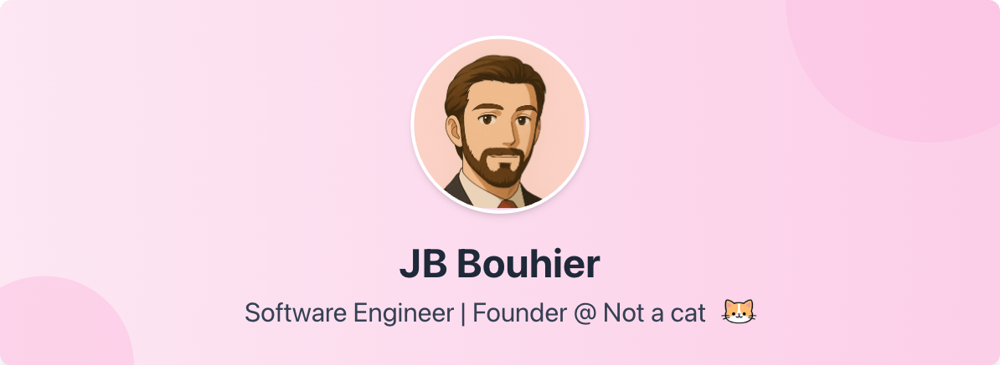

  

<!-- Title/Subtitle -->

  

    Founder 
    @ 
    <a href="https://notacatventures.com" style="color: #58a6ff; text-decoration: none; font-weight: 500;">Not a cat</a>
    •
    Bootstraping SaaS products
  

  
  

    Currently building <a href="https://stripeboost.com" style="color: #58a6ff; text-decoration: none;">Stripe Boost</a>
  

<!-- Social Links -->

  

    
    
    
    
  

<!-- Personal Details Footer -->

  

    🐱 I am not a cat
    •
    🥋 Taekwondo black belt
    •
    <a href="https://etna.io" style="color: #8b949e; text-decoration: none;" onmouseover="this.style.color='#58a6ff'" onmouseout="this.style.color='#8b949e'">🌋 ETNA graduate</a>
  

