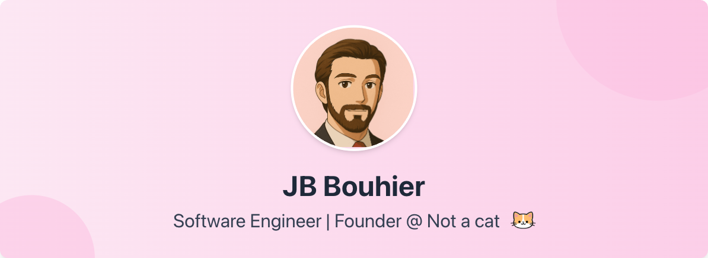

  

  

    Founder 
    @ 
    <a href="https://notacatventures.com" style="color: #58a6ff; text-decoration: none; font-weight: 500;">Not a cat</a>
  

    
    
    
    

  🐱 I am not a cat
  •
  🥋 Taekwondo black belt
  •
  🌋 <a href="https://etna.io" style="color: #58a6ff; text-decoration: none;">ETNA</a> graduate

